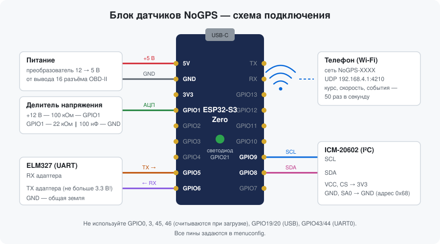

# ELMandIMU — блок датчиков NoGPS на ESP32


Прошивка для небольшого блока, который стоит в машине и помогает навигатору работать **без GPS**: в тоннеле,
на подземной парковке, при глушении сигнала. Блок считает, куда повернула машина (гироскоп) и с какой
скоростью она едет (OBD-II через ELM327), и 50 раз в секунду передаёт это по Wi-Fi в приложение
[NoGPS Maps](https://github.com/Ramzess-II/NoGPSMaps). Телефон только показывает карту, его можно держать
в руках.



## Что умеет

- **Курс машины.** Гироскоп с акселерометром на I²C, 500 отсчётов в секунду. Блок можно закрепить под любым
  углом: калибровка по кнопке в приложении запоминает, где у него «вверх».
- **Автообнуление гироскопа.** На каждой стоянке блок сам уточняет смещение нуля, поэтому курс не уплывает
  от прогрева датчика.
- **Скорость из OBD-II.** ELM327 или STN11xx на UART: блок сам находит скорость порта и протокол машины,
  опрашивает скорость 10 раз в секунду и переподключается после ошибок.
- **Работа без ELM327.** Адаптера нет или он выключен в настройках — блок отдаёт только гироскоп.
- **Wi-Fi и простой протокол.** Блок — точка доступа `NoGPS-XXXX`, данные идут по UDP строками в стиле NMEA
  с контрольной суммой.
- **Журнал событий.** Ошибки датчика, адаптера и машины видны в приложении и не теряются при обрыве связи.
- **Экономия аккумулятора.** Питание в диагностическом разъёме есть всегда, поэтому при заглушенном
  двигателе блок выключает Wi-Fi, перестаёт опрашивать машину и засыпает.
- **Любой гироскоп.** Новый датчик — это один файл драйвера и одна строка в реестре.

> **Состояние проекта.** На столе проверены гироскоп, Wi-Fi, калибровка и работа с приложением. Опрос ELM327,
> измерение напряжения и режимы экономии написаны и собираются, но на машине ещё не проверены. Сборка под
> ESP32-C3 проходит, на плате ещё не проверена.

## Что нужно

| Деталь | Примечание |
|---|---|
| Waveshare ESP32-S3-Zero или плата на ESP32-C3 | Подойдёт любой ESP32 с Wi-Fi: меняются только номера пинов в menuconfig |
| ICM-20602 | Гироскоп с акселерометром, плата с выводами I²C |
| ELM327 или STN11xx | Нужен доступ к его UART (выводы TX и RX микросхемы) |
| Преобразователь 12 → 5 В | Питание от вывода 16 разъёма OBD-II |
| Резисторы 100 кОм и 22 кОм, конденсатор 100 нФ | Делитель для измерения напряжения бортовой сети |

## Подключение

| Сигнал | ESP32-S3-Zero | Куда |
|---|---|---|
| Питание | `5V`, `GND` | Преобразователь 12 → 5 В |
| I²C SDA | `GPIO8` | SDA датчика |
| I²C SCL | `GPIO9` | SCL датчика |
| Питание датчика | `3V3`, `GND` | VCC и GND датчика |
| Выбор I²C | `3V3` | **CS датчика — обязательно к 3V3**, иначе он работает по SPI |
| Адрес датчика | `GND` | SA0 (AD0) к GND — адрес 0x68 |
| UART TX | `GPIO5` | RX адаптера ELM327 |
| UART RX | `GPIO6` | TX адаптера ELM327 |
| Напряжение сети | `GPIO1` | Середина делителя: +12 В — 100 кОм — GPIO1 — 22 кОм — GND, параллельно 22 кОм — 100 нФ |
| Светодиод | `GPIO21` | Встроенный WS2812 |

Важно:

- **Проверьте напряжение на TX адаптера.** У многих клонов ELM327 микросхема работает от 5 В. Входы ESP32-S3
  рассчитаны на 3.3 В: при 5 В нужен делитель или преобразователь уровней.
- На линиях SDA и SCL нужны подтяжки 4.7–10 кОм к 3V3, если их нет на плате датчика.
- Вход АЦП — только `GPIO1`–`GPIO10` (ADC1). ADC2 у ESP32 не работает вместе с Wi-Fi.
- Не занимайте `GPIO0`, `3`, `45`, `46` (считываются при загрузке), `19`/`20` (USB), `43`/`44` (UART0).

### ESP32-C3

Тот же код собирается и под ESP32-C3: значения по умолчанию подставляются сами при выборе чипа.

| Сигнал | ESP32-S3 | ESP32-C3 |
|---|---|---|
| I²C SDA | `GPIO8` | `GPIO6` |
| I²C SCL | `GPIO9` | `GPIO7` |
| UART TX → RX адаптера | `GPIO5` | `GPIO4` |
| UART RX ← TX адаптера | `GPIO6` | `GPIO5` |
| Напряжение сети (АЦП) | `GPIO1` | `GPIO1` |
| Нижнее плечо делителя | 22 кОм | **18 кОм** |
| Светодиод WS2812 | `GPIO21` | `GPIO10` |

Нижнее плечо делителя другое, потому что АЦП ESP32-C3 точно измеряет только до 2.5 В (у S3 — до 3.1 В).
У ESP32-C3 вход АЦП — только `GPIO0`–`GPIO4`; не занимайте `GPIO2`, `8`, `9` (считываются при загрузке),
`18`/`19` (USB), `20`/`21` (UART0). Если на плате обычный светодиод, а не WS2812, выключите
«Адресный светодиод» в разделе **NoGPS LED** и укажите его пин.

Все пины, номиналы делителя и тип светодиода меняются в `menuconfig`, разделы **NoGPS**, **NoGPS OBD (ELM327)**,
**NoGPS питание** и **NoGPS LED**.

## Сборка и прошивка

Нужен [ESP-IDF 5.x](https://docs.espressif.com/projects/esp-idf/en/stable/esp32s3/get-started/). Проект
собирался на версии 5.5.1.

```bash
idf.py set-target esp32s3
```

Для ESP32-C3 — `idf.py set-target esp32c3`. В VS Code чип выбирается кнопкой в строке состояния.

```bash
idf.py build
```

```bash
idf.py -p COM5 flash monitor
```

Порт подставьте свой. Лог идёт через встроенный USB платы. Если после прошивки в мониторе видно
`waiting for download`, нажмите кнопку RESET на плате.

## Первое включение

1. Светодиод часто мигает, затем даёт короткую вспышку раз в секунду — блок ждёт телефон.
2. Подключите телефон к сети `NoGPS-XXXX`. Пароль по умолчанию — `12345678`; смените его в `menuconfig` или
   командой `SET,wifi_pass,…`. Android предложит отключиться от сети без интернета — выберите «Оставаться на
   связи».
3. В приложении NoGPS Maps выберите источник «Блок ESP32». Светодиод загорится постоянно.
4. Закрепите блок в машине **жёстко**, под любым углом, и нажмите «Калибровка», когда машина стоит.
   Калибровка занимает 3 секунды; работающий мотор ей не мешает.

Без телефона блок можно проверить с ноутбука, подключённого к его сети:

```bash
python tools/nogps_client.py
```

Скрипт раз в секунду печатает курс, флаги и частоту данных. Команды (`CAL_UP`, `STATUS`, `EVENTS,1`,
`SET,data_hz,20` и другие) вводятся прямо в нём.

## Светодиод

| Что видно | Что значит |
|---|---|
| Часто мигает, 5 раз в секунду | Wi-Fi поднимается |
| Короткая вспышка раз в секунду | Блок ждёт телефон |
| Горит постоянно | Телефон подключён |
| 2 раза за 2 с гаснет (или вспыхивает, если телефона нет) | Нет гироскопа |
| 3 раза | Нет скорости из OBD |
| 4 раза | Блок сдвинули, нужна повторная калибровка |
| Не горит | Двигатель заглушен, блок экономит аккумулятор |

## Экономия аккумулятора

Работает ли двигатель, блок узнаёт у машины: скорость больше нуля, а при нулевой скорости — обороты
больше нуля.

| Этап | Когда | Что происходит |
|---|---|---|
| Работа | Двигатель работает, а также первая минута после включения | Всё включено |
| Стоянка | Через 1 минуту без скорости и оборотов | Wi-Fi и светодиод выключены. Адаптеру и машине не уходит ни одного байта, чтобы не мешать машине уснуть |
| Сон | Через 10 минут | ESP32 и гироскоп спят. Раз в 2 секунды блок просыпается измерить напряжение |
| Подъём | Напряжение выросло на 0.4 В над уровнем, запомненным при засыпании | Блок снова опрашивает машину. Нет скорости и оборотов — через минуту засыпает опять |

На стоянку и в сон блок уходит, только если своему делителю напряжения можно доверять: после включения его
показания совпали с напряжением от машины (PID 42) или от ELM327 в пределах 10 %. По этому же эталону делитель
калибруется. Без делителя блок выключает только Wi-Fi и продолжает опрашивать машину.

Времена задаются настройками `wifi_off_s` и `sleep_after_s`; `0` выключает соответствующий этап.

## Настройки

Хранятся во флеш-памяти (NVS), меняются командой `SET,<ключ>,<значение>`. «Сразу» — действует без
перезагрузки, остальные — после `REBOOT`.

| Ключ | По умолчанию | Смысл |
|---|---|---|
| `wifi_ssid` | `NoGPS-XXXX` | Имя сети |
| `wifi_pass` | `12345678` | Пароль, 8–63 символа |
| `imu_odr` | 400 | Желаемая частота гироскопа, Гц (ICM-20602 даёт 500) |
| `data_hz` | 50 | Частота данных для телефона, 10–100 (сразу) |
| `still_acc` | 0.08 | Порог неподвижности по ускорению, м/с² (сразу) |
| `still_gyro` | 0.3 | Порог неподвижности по гироскопу, °/с (сразу) |
| `still_rate` | 0.5 | Наибольший средний поворот на стоянке, °/с (сразу) |
| `bias_max_jump` | 0.5 | Ограничение скачка смещения нуля на короткой стоянке, °/с (сразу) |
| `obd_enabled` | 1 | 0 — не искать ELM327 |
| `obd_baud` | 0 | Скорость UART адаптера, 0 — найти автоматически |
| `obd_proto` | 0 | Протокол ELM327, 0 — авто; записывается сам после поиска |
| `wifi_off_s` | 60 | Через сколько секунд без двигателя выключить Wi-Fi; 0 — никогда (сразу) |
| `sleep_after_s` | 600 | Через сколько секунд без двигателя уснуть; 0 — не спать (сразу) |

Во флеш автоматически пишется немногое: найденные скорость порта и протокол адаптера и поправочный
коэффициент делителя. Калибровка гироскопа сохраняется только по команде из приложения.

## Протокол

UDP, порт 4210, одна строка в датаграмме: `$поля,через,запятую*CRC\r\n`, контрольная сумма
CRC-16/CCITT-FALSE.

| Строка | Направление | Что в ней |
|---|---|---|
| `NGD` | блок → телефон, 50 раз в секунду | Накопленный поворот, скорость, флаги состояния |
| `NGS` | блок → телефон, раз в секунду | Датчик, состояние OBD, двигатель, обороты, напряжения |
| `NGE` | блок → телефон | События и ошибки |
| `NGC` | телефон → блок | Команды: `HELLO`, `CAL_UP`, `CAL_BIAS`, `SET`, `EVENTS`, `REBOOT` и другие |
| `NGA` | блок → телефон | Ответ на команду: `OK`, `ERR,<код>`, `PROGRESS,<%>` |

```
$NGD,1,1234,845213,-15300,0,0,-1,-1,227*AEEE
$NGC,18,CAL_UP*5D27
$NGA,18,OK*461D
```

Полное описание протокола и требований к прошивке — файл `docs/nogps/esp32-firmware-spec.md` в
[репозитории приложения](https://github.com/Ramzess-II/NoGPSMaps).

## Устройство прошивки

```
imu (драйверы) ──▶ motion (курс, стоянки, калибровка) ──▶ proto ──▶ net (Wi-Fi, UDP)
obd (ELM327)   ──▶ motion                                            ▲
power (напряжение, стоянка, сон) ──▶ obd, net                         │
events (журнал) ◀── все компоненты ───────────────────────────────────┘
```

| Компонент | Что делает |
|---|---|
| `components/imu` | Реестр драйверов, автоопределение датчика по WHO_AM_I, чтение из FIFO |
| `components/motion` | Неподвижность, курс вокруг вертикали, автообнуление, калибровка по команде |
| `components/calib` | Хранение калибровки в NVS |
| `components/obd` | ELM327: поиск порта, инициализация, скорость, обороты, напряжение, ошибки |
| `components/power` | Измерение напряжения, стоянка, сон, калибровка делителя |
| `components/net` | Точка доступа, UDP, команды и строки протокола |
| `components/proto` | Сборка и разбор строк, CRC-16 |
| `components/events` | Журнал последних 32 событий |
| `components/config` | Настройки в NVS |
| `components/led` | Светодиод состояния |
| `tools/nogps_client.py` | Проверка блока с ноутбука |

Ни один компонент, кроме `imu`, не знает, какая стоит микросхема, и ни один, кроме `obd`, не знает про
ELM327. Отказ любого из них не останавливает остальные.

## Как добавить другой гироскоп

1. Скопируйте [`components/imu/drivers/imu_icm20602.c`](components/imu/drivers/imu_icm20602.c) под новым
   именем.
2. Поменяйте в нём имя, адреса I²C, регистр и значение WHO_AM_I, инициализацию и разбор данных. Драйвер
   отдаёт угловую скорость в рад/с и ускорение в м/с² в осях датчика, правая тройка.
3. Добавьте строку в [`components/imu/imu_registry.c`](components/imu/imu_registry.c) и файл в
   `components/imu/CMakeLists.txt`.
4. Проверьте знак: поворот блока на 90° направо (по часовой стрелке, если смотреть сверху) должен дать
   +90° курса, в двух разных положениях блока.

Остальная прошивка и приложение при этом не меняются.

## Связанные проекты

- [NoGPS Maps](https://github.com/Ramzess-II/NoGPSMaps) — приложение для Android, которое принимает данные
  блока.

## Лицензия

[MIT](LICENSE): код можно свободно использовать, менять и распространять, в том числе в коммерческих
проектах. Условие одно — сохранить текст лицензии и указание автора.
